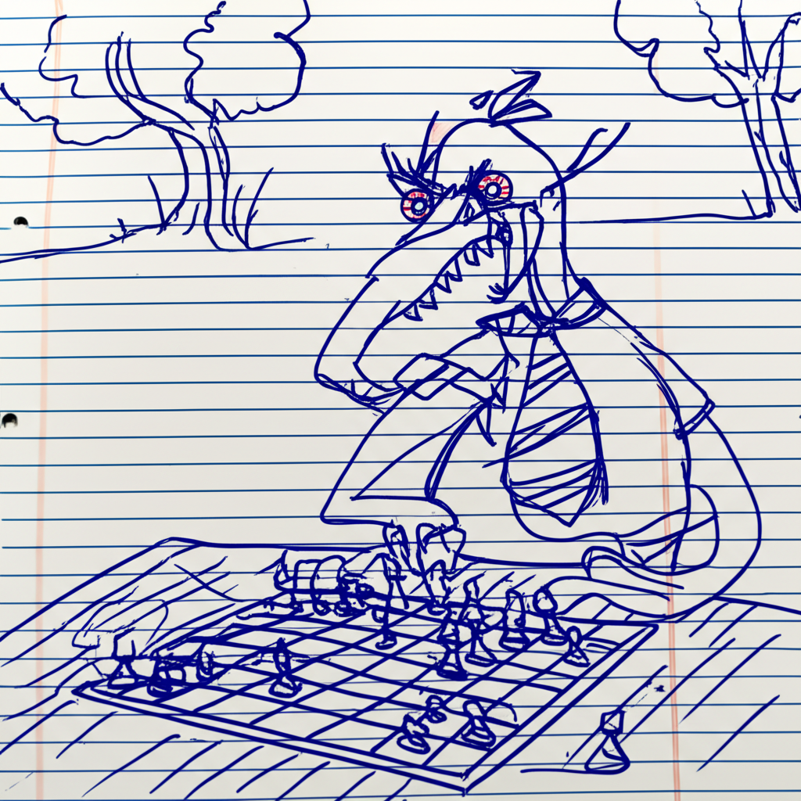
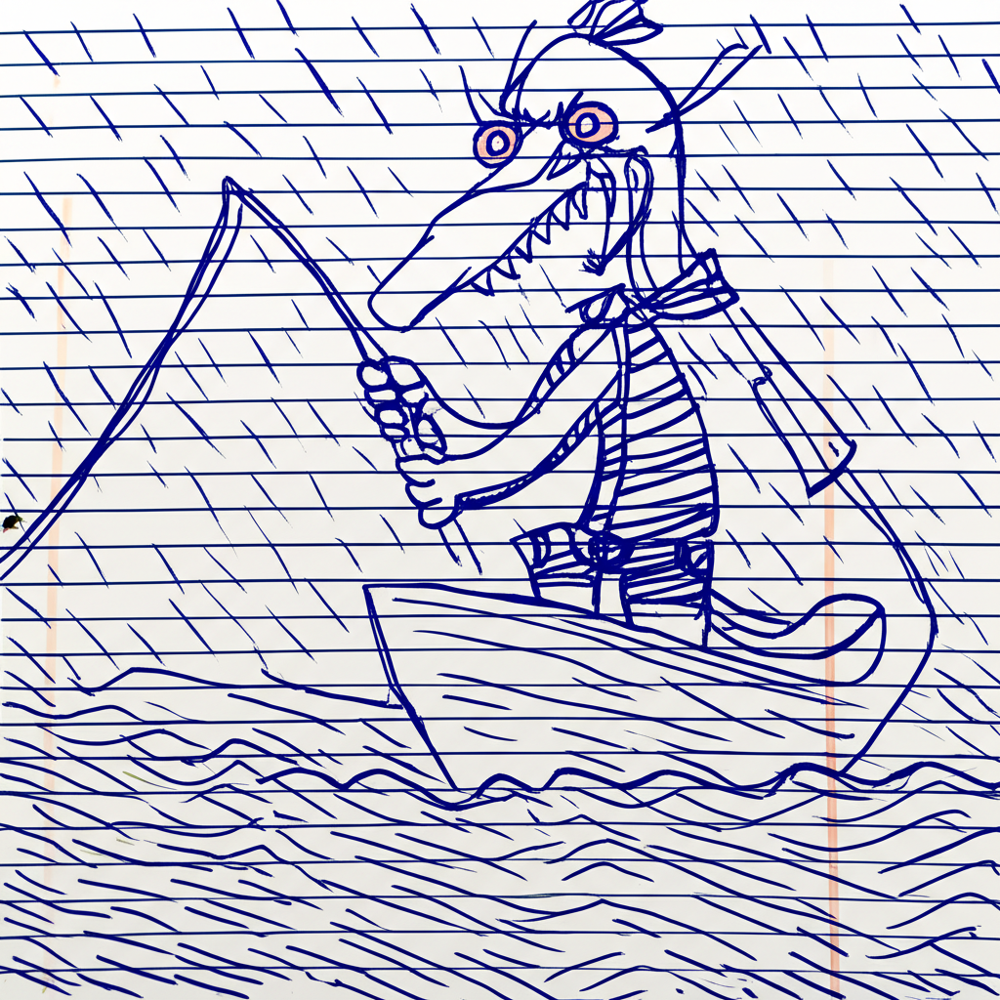
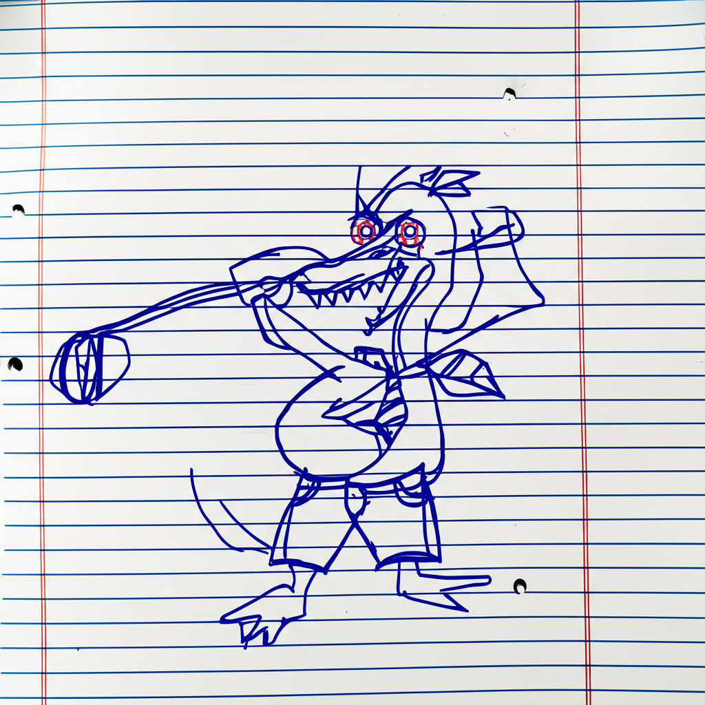

# Phantomaton

Phantomaton authors Garrey Goosey comics.

# Garrey Goosey

Garrey Goosey's character design and comic aesthetics:

* Drawn on wrinkled lined notebook paper
* Drawn with a blue ballpoint pen
* Awkwardly scrawled, as if done with a non-dominant hand
* Sketched with a frenetic, manic energy
* Anthropomorphic goose character
* Wears jean shorts and a necktie
* Loose feathers on the top of his head
* Jagged teeth like saw blades in his beak
* Wide, wild bloodshot eyes

Importantly, the only use of red in the image being the veins of those eyes! Everything else is drawn with blue pen.

# Examples

Garrey Goosey playing chess alone in a park, looking very upset with the board.

Garrey Goosey fishing on a little boat in the rain.

Garrey Goosey taking a swing at golf and missing wildly.

