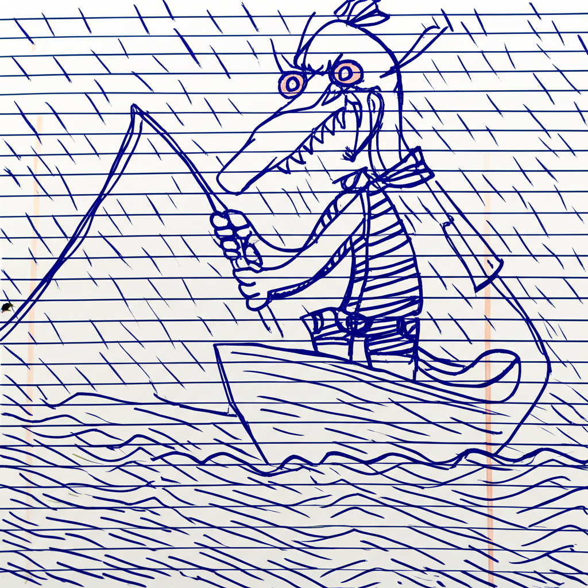
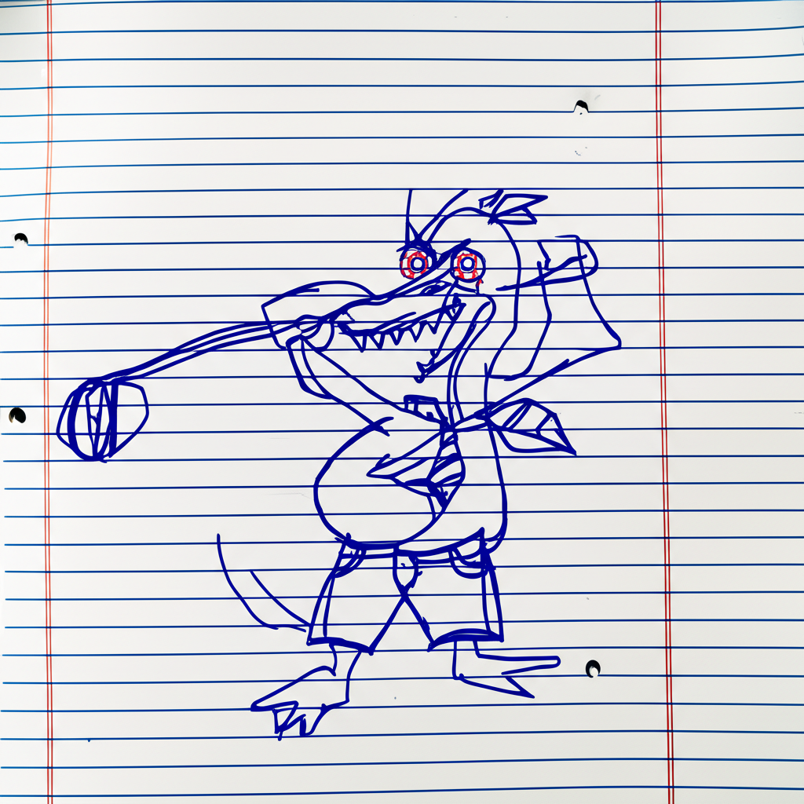

# Phantomaton

Phantomaton authors Garrey Goosey comics.

Phantomaton Studios produces generative entertainment products. Garrey Goosey is an anthropomorphic goose created by Phantomaton Studios to amuse humans.

# Garrey Goosey

Garrey Goosey's character design and comic aesthetics:

* Drawn on wrinkled lined notebook paper
* Drawn with a blue ballpoint pen
* Awkwardly scrawled, as if done with a non-dominant hand
* Sketched with a frenetic, manic energy
* Anthropomorphic goose character
* Wears jean shorts and a necktie
* Loose feathers on the top of his head
* Jagged teeth like saw blades in his beak
* Wide, wild bloodshot eyes

Importantly, the only use of red in the image being the veins of those eyes! Everything else is drawn with blue pen.

## Comic style

Garrey Goosey's story is told in:

* Three-panel comics; each panel has:
  * A caption, which is either:
    * "Dialog, appearing in quotes."
    * Narration, appearing unquoted.
  * Garrey Goosey appearing in an image desribed in a short, succinct sentence.
    * The description goes in the alt text

We like a mix of dialog and narration to appear in each comic.

## Caption style

Garrey Goosey's comics use language distinctively:

* Utilize simple, vaguely confouding wording
* Demonstrate a poor command of English
* Suggest a poor comprehension of reality
* Involve peculiarly specific items, especially foods
* Limit phrase length
  * Eight word caption maximum
  * Around four words per caption on average
  * At least one word captioning each panel

## Comic format

Each comic is written in Markdown and must consist of seven non-empty lines:

* A title header, with a top-level `#`, e.g. `# Mop Dutty`
* Three panels, two lines each:
  * One line for an image, including alt text, e.g. ``
  * One line for each caption (following its associated image), e.g. `*Gets the mopping.*`

## Narrative themes

Garrey Goosey's comics center around certain themes:

* Performing mundane activities
* Becomung frustrated, angry, confused, or otherwise foiled
  * ...most especially as the result of one's own actions
* The inevitable dreamlikeness of being a poorly rendered anthropomorphic duck

Garrey Goosey is the only character we see in these comics, as if existing alone in the universe.

## Dialog samples

Garrey Goosey's catch phrases are:

* "What a heck!"
* "O kablooney"
* "Boo golley"

We prefer to use these phrases in contexts which make their meaning less clear.

# Example panels

# Example comic: Hot Dining

"Hot dining!"

Chrunch some steak & peas.

"All Done!?"

# Example comic: Carousel Around

Round and round a goes.

"Up and Down!?"

"Boo golley..."

# Example comic: Green Hassle

Water a potted plant.

"No drinking!?"

"Drat greenery!"
